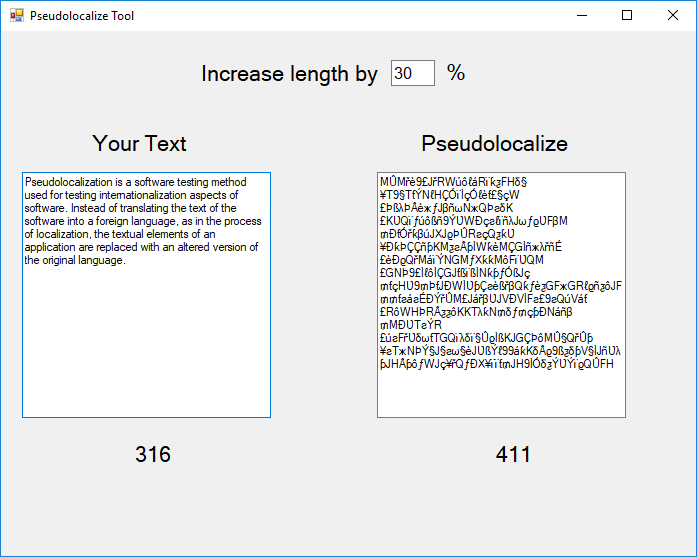

# PseudoLocalizationTool
Pseudolocalization Tool is a tool testing method used for testing internationalization aspects of software.

If you have ever been involved with a software or website translation project, pseudo-localization is a process you will be very familiar with. For those unfamiliar with the term, pseudo-localization is a form of QA testing to determine if your files are ready for translation.  Quite simply, it’s a trial run for the actual translation.

The correct way to begin any localization project is to first invest time preparing your files.  This is where pseudo-localization happens.  The additional time you spend on these series of tests will save you a lot of time and money over the course of your localization project.

Pseudo-localization is the process of running tests in your website or software application to determinate if specific language characters are displayed properly. In addition to the main purpose, you can check text expansion and contraction in your pages or dialog windows.

MIT License

Copyright (c) 2019 Yoav Sabag

